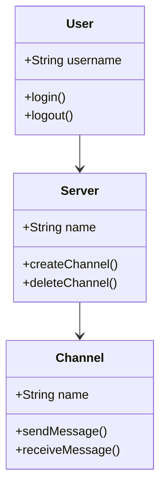
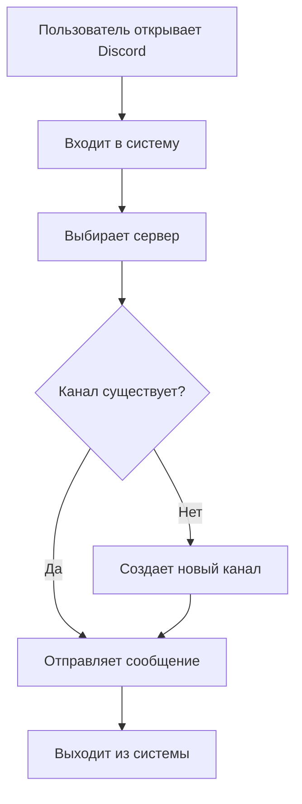
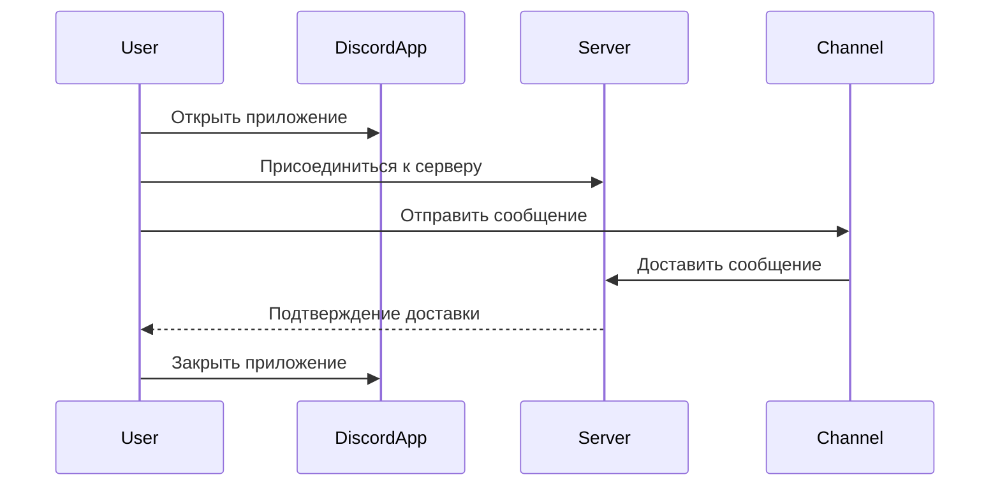

#wwwwwwwwwwwwwwwwFFFFFFFFAAAAAA
---

# KhamatnurovDenisIs32k1
# Discord

**Discord** - это популярная платформа для коммуникации и совместной работы, которая предоставляет различные инструменты для общения пользователей через интернет.

## Основные возможности
- Удобный интерфейс
- Сервера по всему миру
- Кроссплатформенное приложение
- Интеграция с другими сервисами (например, Twitch, YouTube)
- Поддержка голосовых и видеозвонков
- Система каналов для организации общения
- Боты и интеграции для расширения функциональности

## Преимущества
- Гибкая настройка серверов под нужды сообществ
- Возможность создания отдельных каналов для разных тем
- Поддержка многоканальных чатов и личные диалоги
- Простота использования для начинающих пользователей
- Профессиональный дизайн и удобство интерфейса

## Безопасность и конфиденциальность
- Защита от спама и вредоносного контента
- Возможность настройки приватности профиля
- Защищенное соединение с использованием SSL/TLS

## UML Диаграммы

### Диаграмма классов (Class Diagram)

- **User** представляет собой класс, описывающий пользователя в системе с методами для входа и выхода.
- **Server** управляет созданием и удалением каналов.
- **Channel** отвечает за отправку и прием сообщений.

### Диаграмма активности (Activity Diagram)

- На диаграмме активности показано, как пользователь проходит через процесс взаимодействия с Discord, начиная с входа в систему и заканчивая отправкой сообщения.

### Диаграмма последовательности (Sequence Diagram)

- Эта диаграмма показывает шаги, как пользователь отправляет сообщение через приложение Discord и взаимодействует с сервером и каналом.

## Дополнительная информация
**Discord** предоставляет разработчикам доступ к API, которое позволяет создавать ботов и интеграций для расширения функциональности платформы. Для этого можно использовать официальную документацию Discord API и присоединиться к сообществам разработчиков.
Проект также содержит примеры кода и ресурсы для изучения API Discord, что помогает начинающим разработчикам начать работу над своими проектами.

---
